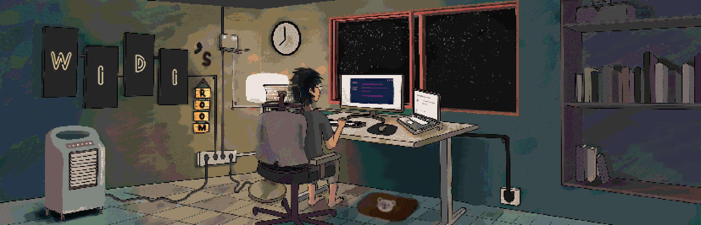

<h1 align="center">Hi 👋, I'm Widi Rahman</h1>
<h3 align="center">An enthusiast exploring tech through research and experimentation</h3>
 

- ⚡ I'm currently in the process of cleaning up and uploading old projects to GitHub

- 🔭 I'm working on developing the [**Elgo package**](https://github.com/widirahman62/pkg-go-elgo)

- 💻 I'm focused on backend development

- 💼 I'm actively freelancing in the tech-related field

<h3 align="left">Connect with me:</h3>

<h3 align="left">My GitHub Stats:</h3>

